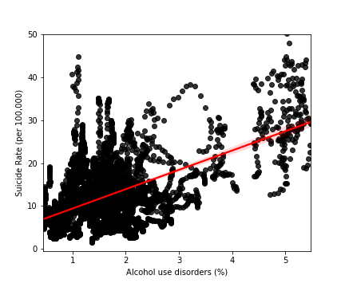
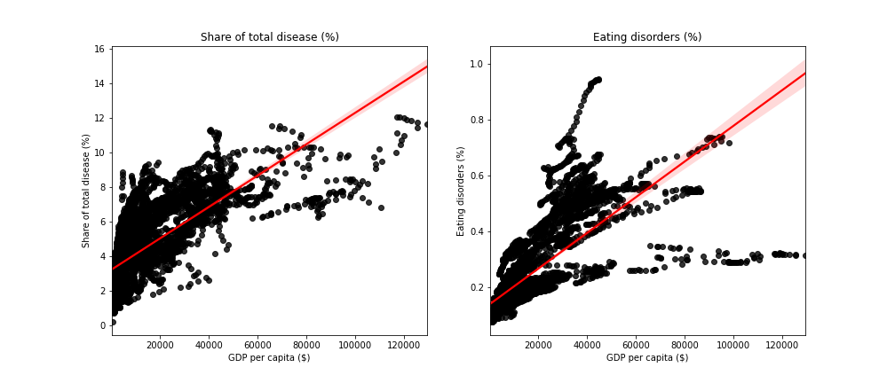
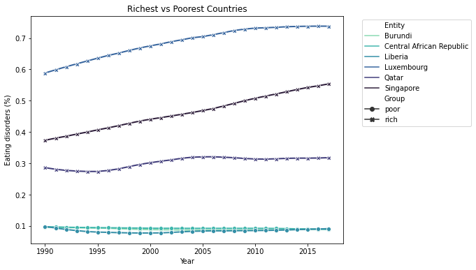
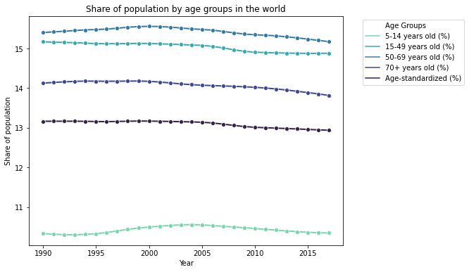
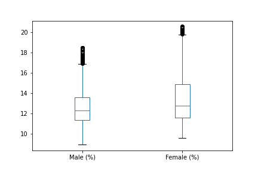
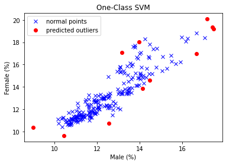

# Mental health and substance use disorders

*Mental health and substance use disorders affect our life in all directions and are very common illnesses in the world. The prevalence of mental health and substance disorders includes depression, anxiety, bipolar, eating disorders, alcohol or drug use disorders, and schizophrenia. They involve changes in thinking, mood, and/or behavior. In 2017, there were more than one in ten people globally suffering from mental health disorder (10.7%).The goal of this project is to show people how mental health and substance use disorders look like in the world and different countries, how it behaves differently by ages and genders, and use unsupervised machine learning to detect outlier countries with gender rates data.*

## 1. Data

The datasets used for this project were produced by the Institute for Health Metrics and Evaluation and reported in their flagship Global Burden of Disease study. The original blog was published on [Our World in Data] (https://ourworldindata.org/mental-health#all-charts-preview). 8 datasets were downloaded from Our World in Data chart sources.  All datasets included Entities (231 uniques), Country code, and Year (1990 to 2017) columns. Additional columns belonging to each dataset show below, and you can download them by clicking each title.

> * [Death rates from mental health and substance use disorders](https://ourworldindata.org/grapher/death-rates-from-mental-health-and-substance-use-disorders?tab=chart)

> * [GDP per capita](https://ourworldindata.org/grapher/gdp-per-capita-worldbank?tab=chart&region=World)

> * [Mental and substance use disorders as a share of total disease burden](https://ourworldindata.org/grapher/mental-and-substance-use-as-share-of-disease?tab=chart)
> * [Prevalence by mental and substance use disorder](https://ourworldindata.org/grapher/prevalence-by-mental-and-substance-use-disorder)

> * [Prevalence of mental and substance use disorders across age groups](https://ourworldindata.org/grapher/prevalence-of-mental-and-substance-disorders-by-age)

> * [Share of population with mental health and substance use disorders](https://ourworldindata.org/grapher/share-with-mental-and-substance-disorders?tab=chart)
> * [Share of population with mental or substance disorders, male vs. female](https://ourworldindata.org/grapher/share-with-mental-or-substance-disorders-by-sex)

> * [Suicide death rates vs. prevalence of mental & substance use disorders](https://ourworldindata.org/grapher/suicide-rates-vs-prevalence-of-mental-and-substance-use-disorders)

## 2. Data Cleaning 

[Data Cleaning Notbook](https://github.com/yuhan0623/Springboard/blob/master/Capstone%20project-2/Mental%20health%20and%20substance%20use%20disorders_data%20wrangling.ipynb)
The datasets were very clean, so I didn't do too much on it. 

## 3. EDA

[EDA Notebook](https://github.com/yuhan0623/Springboard/blob/master/Capstone%20project-2/Mental%20health%20and%20substance%20use%20disorders_EDA.ipynb)

Here are some main findings from EDA.
* There is a positive linear correlation between suicide rate and alcohol use disorders. 

*  GDP per capita has stronger positive correlations with mental health and substance use disorders as a share of total disease burden (r=0.73) and eating disorders (r=0.75).

* All rich countries have much higher rates than poor countries for eating disorders.

* The 50-69 years old age group shows the highest percentage, the 5-14 years old age group shows the lowest percentage.

* I applied statistical tests to check if it's a significant difference between male and female. The p-value from the t-test and permutation test is less than the significance level of 0.05. So the share of the population with mental or substance use disorders between male and female are significantly different. And from the average rates, we can see that the female tends to have higher rates than male.

## 4. Modeling

[Modeling Notebook](https://github.com/yuhan0623/Springboard/blob/master/Capstone%20project-2/Mental%20health%20and%20substance%20use%20disorders_Modeling.ipynb)

I used the share of the population with mental or substance disorders (male vs. female) data to identify the country outliers using unsupervised clustering machine learning. I applied the following different models and evaluated the models with visualization. The **One-Class SVM** was chosen because it best identified the outliers.

* Isolation Forest. 
* One-Class SVM (The figure shows below)
* DBSCAN 
* Local Outlier Factor (LOF)
* Elliptic Envelope 

