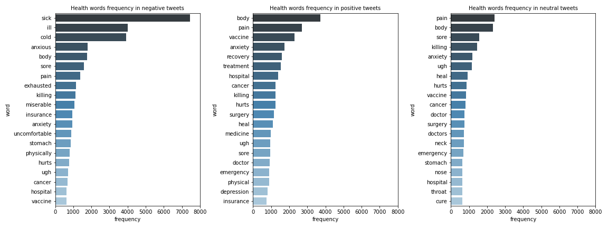

# Sentiment Analysis of Health Tweets

*2020 is a hard year for everyone, thus health became the most common concern in our lives. In this project I analyzed the tweets about health and try to know what type of health people are talking most. Then I did sentiment analysis, and found out that the propotion of positive tweets are most, the propotion of negative tweets are a little less, the propotion of nuetral tweets are least.*

## 1. Data Collection

[Data Collection Notbook](https://github.com/yuhan0623/Springboard/blob/master/Capstone%20project-2/Mental%20health%20and%20substance%20use%20disorders_data%20wrangling.ipynb)
The tweets data was scraped by using tweepy based on health keywords from Twitter API.

## 2. Data Wangling 

[Data Wangling Notbook](https://github.com/yuhan0623/Springboard/blob/master/Capstone%20project-2/Mental%20health%20and%20substance%20use%20disorders_data%20wrangling.ipynb)
Regular data cleaning
* NA data
* Duplicates
* Change the type of some columns
Text data cleaning
* Make text all lower case
* Remove URLs
* Remove punctuation
* Remove common non-sensical text (\n)
* Remove stopwords 

## 3. EDA

[EDA Notebook](https://github.com/yuhan0623/Springboard/blob/master/Capstone%20project-2/Mental%20health%20and%20substance%20use%20disorders_EDA.ipynb)

Here are some main findings from EDA.
* Vocabulary from all tweets without unmeaning frequent words. 

* Health words frequency in all tweets.

## 4. Sentiment Analysis

[Sentiment Analysis Notebook](https://github.com/yuhan0623/Springboard/blob/master/Capstone%20project-2/Mental%20health%20and%20substance%20use%20disorders_Modeling.ipynb) 

* Sentiment count

* Health words frequency in each sentiment category

